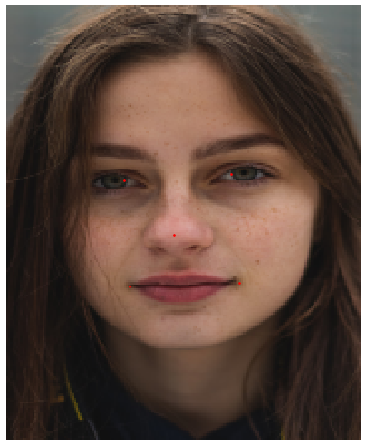

 # Face Landmarks with WingLoss

In this project, I have implemented a Face landmarks prediction model with fastai v1. The model was trained with a novel loss function "Wing loss" proposed in (https://arxiv.org/abs/1711.06753) this paper. 
# Results
 

# Steps to run

To test the model,
1. Clone the repo.
2. Open the notebook.
3. Run the import statements in the start of the notebook.
4. Run the cell with wing loss definition.
5. Scroll to the bottom of the page and run the last section.
